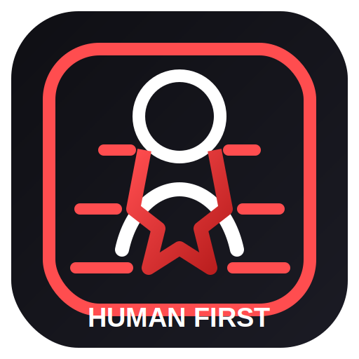

# Anti-AI Movement

  

  <strong>Labor Rights over Algorithmic Interests</strong> 
  <strong>劳动者权益高于算法利益</strong>

  
  
  

  <a href="README.md">English</a> | <a href="README_CN.md">简体中文</a> | <a href="locales/ja/MANIFESTO.md">日本語</a> | <a href="locales/fr/MANIFESTO.md">Français</a> | <a href="locales/es/MANIFESTO.md">Español</a> | <a href="locales/de/MANIFESTO.md">Deutsch</a> | <a href="locales/ru/MANIFESTO.md">Русский</a> | <a href="locales/ko/MANIFESTO.md">한국어</a>

> This is not a campaign against technology.
>
> It is a public movement against the use of AI as a low-cost weapon to replace workers, suppress wages, and extract value from human creativity without consent.

## Why We Speak Up

AI is often marketed as an efficiency revolution, but many workers are living through a different reality:

- Jobs disappear while transition support never arrives.
- Human-created work is scraped, processed, and monetized without permission.
- Decisions are outsourced to algorithms while risk, pressure, and accountability remain with people.
- "Optimization" becomes a polite word for weakening labor bargaining power.

We do not reject tools. We reject a system where technology is used to transfer wealth upward while workers absorb the cost.

## What We Stand For

1. **Right to Work**: Oppose large-scale AI-driven replacement of human labor without compensation, retraining, and a real transition plan.
2. **Algorithmic Transparency and Accountability**: Any AI system affecting hiring, scheduling, evaluation, pay, or layoffs must be open to scrutiny and responsibility.
3. **Data and Creative Sovereignty**: Human code, writing, voice, images, and knowledge must not be used to train commercial models without consent.
4. **Redistribution of AI Gains**: Profits generated by automation should partially return to workers through social protection, unemployment support, and retraining funds.
5. **Human-AI Collaboration First**: Technology should strengthen human capability before it is allowed to erase human roles.

## What This Repository Is For

- Publish a clear public manifesto and a shared set of demands.
- Collect real stories and evidence from industries affected by AI displacement.
- Expand into multiple languages so more workers can participate.
- Build an open foundation for future policy, organizing, and advocacy work.

## Who Should Join

- Developers, designers, writers, teachers, customer support staff, translators, legal workers, media professionals, and industrial workers facing AI pressure.
- Researchers and lawyers focused on labor law, digital rights, intellectual property, and tech ethics.
- Builders inside the tech industry who believe tools should serve people instead of replacing them by default.

## How to Join

1. **Star this repository**: Help turn scattered anxiety into visible public attention.
2. **Read and share the manifesto**: Start with the [Anti-AI Labor Manifesto](MANIFESTO.md) and send it to coworkers, friends, and communities.
3. **Submit stories and observations**: Open an Issue, Discussion, or PR with real examples from your field.
4. **Contribute translations and visuals**: Help expand the project with more languages, posters, icons, and campaign assets.
5. **Push the conversation forward**: Use `#AntiAI` and `#HumanLaborFirst` to make the debate public and concrete.

## Core Slogans

- **Human dignity cannot be automated away.**
- **Creative work is not a data mine. Labor is not disposable overhead.**
- **A truly advanced technology should make people live better, not make them easier to replace.**

## Resources

- [Anti-AI Labor Manifesto (English)](locales/en/MANIFESTO.md)
- [反 AI 劳动者宣言 (Chinese)](locales/zh-CN/MANIFESTO.md)
- [Anti-AI Labor License (AALL)](ANTI-AI-LICENSE.md)
- [Contributing Guide](CONTRIBUTING.md)

---

**Human creativity should not be harvested by algorithms.**

**The human right to exist should not give way to efficiency.**
